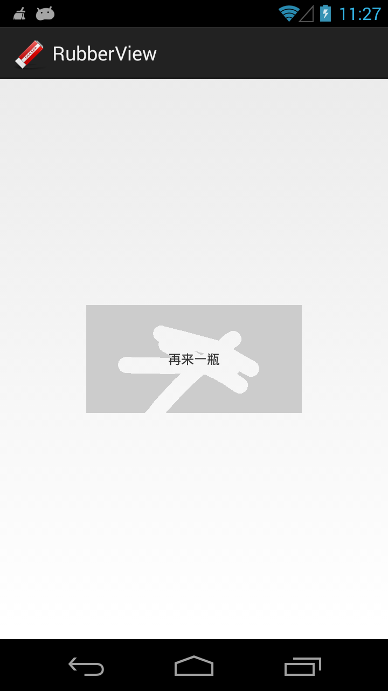

# 停止维护 仅供查考

# ![logo_image] ScratchAwardView

![Platform][platform_image]
[![API][min_api_image]][min_api_link]

这是一个刮刮卡组件，用于实现刮奖效果



## 开始使用

你只需将 ScratchAwardView 覆盖在中奖提示语之上即可，这样的用法很灵活，因此你可以决定你的中奖提示语是一段文字或者一张图片，如下所示：

```xml
<FrameLayout
    xmlns:android="http://schemas.android.com/apk/res/android"
    android:layout_width="match_parent"
    android:layout_height="match_parent"
    android:layout_centerInParent="true">
    <TextView
        android:text="再来一瓶"
        android:gravity="center"
        android:layout_width="200dp"
        android:layout_height="100dp"
        android:layout_gravity="center"/>

    <me.panpf.scratch.ScratchAwardView
        android:id="@+id/scratch_main"
        android:layout_width="200dp"
        android:layout_height="100dp"
        android:layout_gravity="center"/>
</FrameLayout>
```

扩展功能：
* 调用 setMaskImage() 方法自定义遮罩图片，默认的是灰色
* 调用 setStrokeWidth() 方法自定义画笔宽度
* 调用 enableAcrossMonitor() 方法监听用户划过的区域，你可以指定一个隐藏在 ScratchAwardView 下面的视图，当用户划过这个视图的时候就会触发回调

## License
    Copyright (C) 2017 Peng fei Pan <sky@panpf.me>

    Licensed under the Apache License, Version 2.0 (the "License");
    you may not use this file except in compliance with the License.
    You may obtain a copy of the License at

      http://www.apache.org/licenses/LICENSE-2.0

    Unless required by applicable law or agreed to in writing, software
    distributed under the License is distributed on an "AS IS" BASIS,
    WITHOUT WARRANTIES OR CONDITIONS OF ANY KIND, either express or implied.
    See the License for the specific language governing permissions and
    limitations under the License.

[logo_image]: sample/src/main/res/drawable-mdpi/ic_launcher.png
[platform_image]: https://img.shields.io/badge/Platform-Android-brightgreen.svg
[min_api_image]: https://img.shields.io/badge/API-10%2B-orange.svg
[min_api_link]: https://android-arsenal.com/api?level=10
